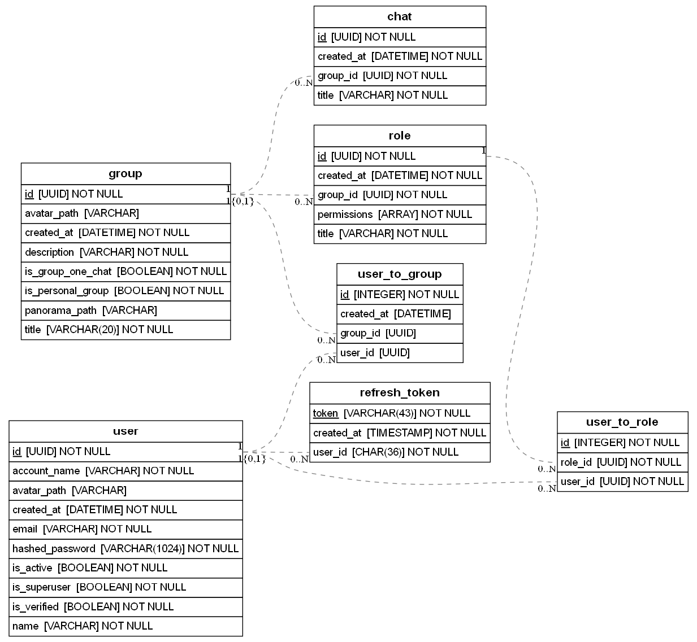
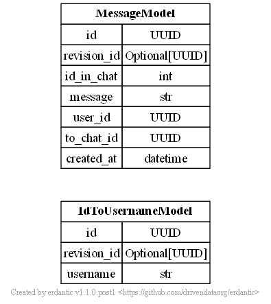

### Margelet

это мессенджер, доступный в виде веб-сайта, десктопного и мобильного приложения

#### Стек

##### Фронтенд

bun (аналог npm)
react (vite)
tanstack router
tanstack query
tailwindcss
lucide (Иконки)

##### Бэкэнд

uvicorn (аналог pip)
fastapi
sqlalchemy (postgres)
beanie (mongodb)

#### Про токены

Токены:

- Refresh токен хранится в бд и устанавливается бэкэндом в куки клиента при запросе в эндпоинт login
- Access токен - jwt токен, который используется при обращении к эндпоинтам, позволяет делать меньше запросов к бд, управляется автоматически с помощью service-worker

#### Стилизация - ограничения

Названия

**Общие**

- Названия файлов и папок в стиле snake_case

**frontend**:

- Компоненты называется в стиле PascalCase
- Названия css стилей в стиле snake_case

**backend**:

- в основном согласно PEP8
- Depends перменные - "SomeValueDep"

### TODO

- прокси от frontend к backend и, что избавит от прописывания 2 адресов
- добавить работу с фото, аватарками и тд

#### Прочее

Caddyfile - необходимо указывать домен/ip

##### Как устроена работа с сообщениями

##### ERD

